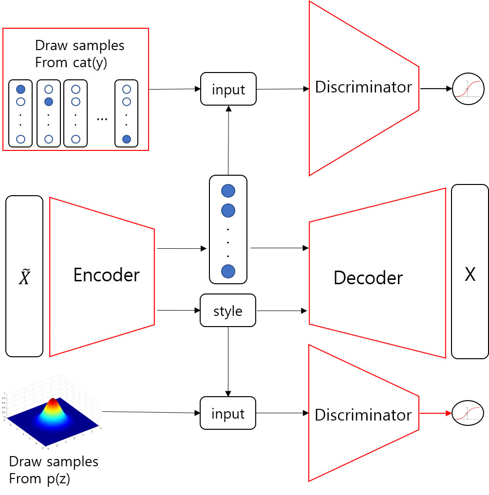

## Adversarial AutoEncoder(AAE)- Tensorflow

**I Write the Tensorflow Code for Supervised AAE and SemiSupervised AAE**

## Enviroment
- OS: Ubuntu 16.04

- Graphic Card /RAM : 1080TI /16G

- Python 3.5

- Tensorflow-gpu version:  1.4.0rc2 

- OpenCV 3.4.1

## Schematic of CVAE

**Supervised AAE**

**SemiSupervised AAE**

## Code
