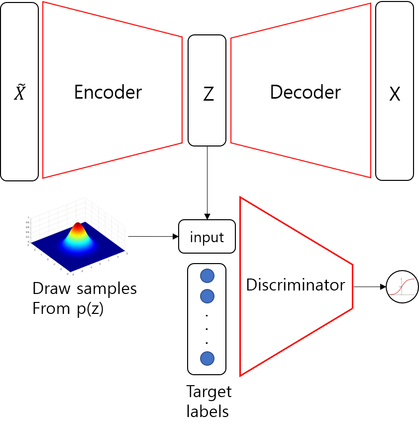
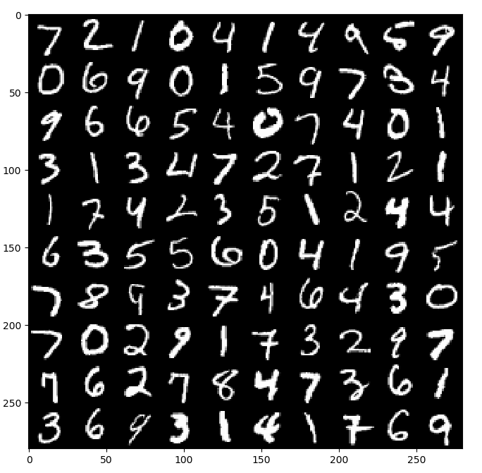
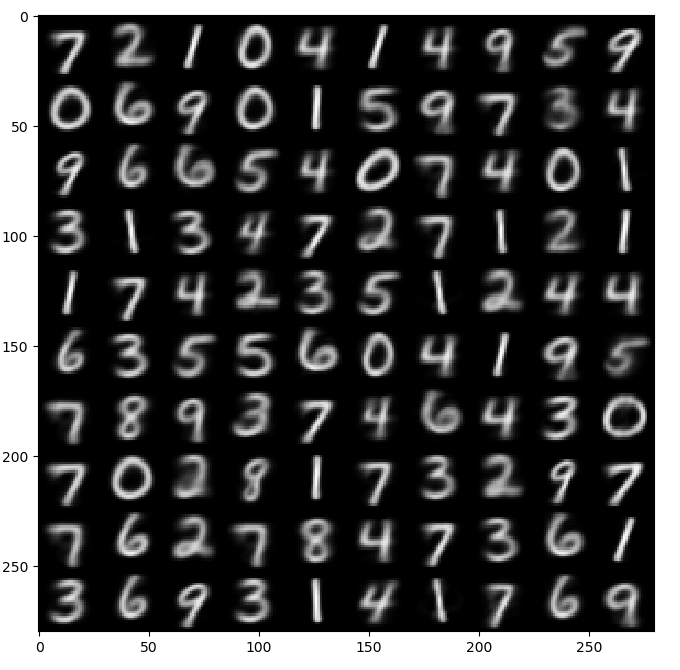
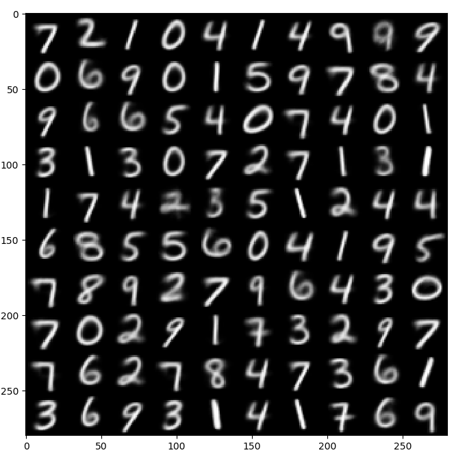
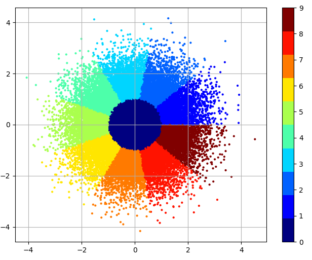
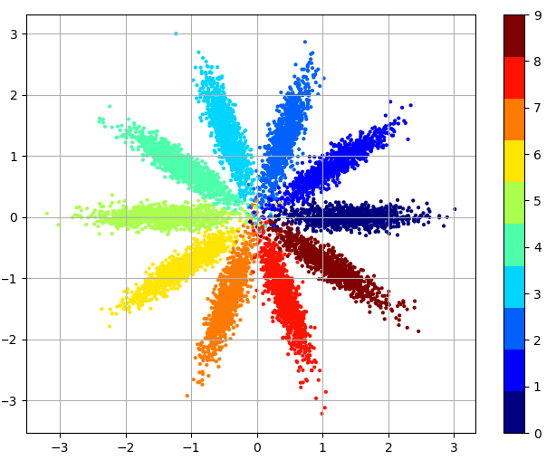
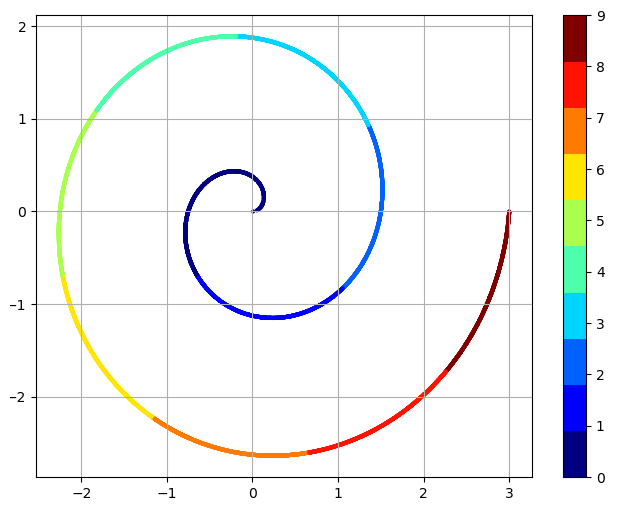
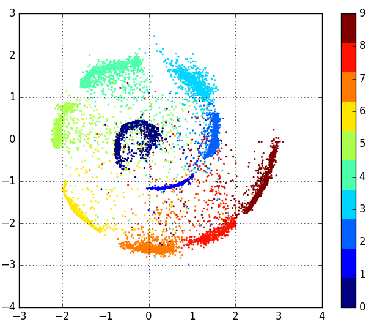
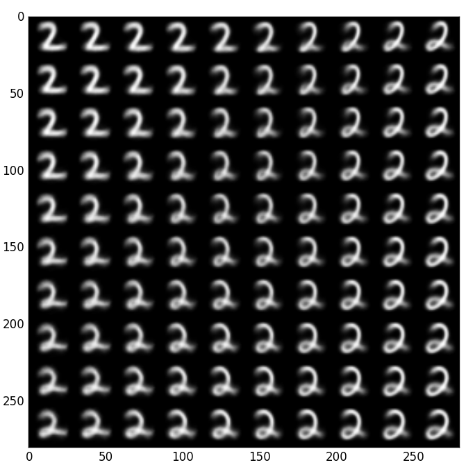

## Adversarial AutoEncoder(AAE)- Tensorflow

I write the Tensorflow Code for Supervised AAE and SemiSupervised AAE

## Enviroment
- OS: Ubuntu 16.04

- Graphic Card /RAM : 1080TI /16G

- Python 3.5

- Tensorflow-gpu version:  1.4.0rc2 

- OpenCV 3.4.1

## Schematic of AAE

### Supervised AAE



***

### SemiSupervised AAE


## Code

**Supervised Encoder**
```python
def sup_encoder(self, X, keep_prob): # encoder for supervised AAE
    
    with tf.variable_scope("sup_encoder", reuse = tf.AUTO_REUSE):
        net = drop_out(relu(dense(X, self.super_n_hidden, name = "dense_1")), keep_prob)
        net = drop_out(relu(dense(net, self.super_n_hidden, name="dense_2")), keep_prob)
        net = dense(net, self.n_z, name ="dense_3")
    
    return net
```

**Supervised Decoder**
```python
def sup_decoder(self, Z, keep_prob): # decoder for supervised AAE

    with tf.variable_scope("sup_decoder", reuse = tf.AUTO_REUSE):
        net = drop_out(relu(dense(Z, self.super_n_hidden, name = "dense_1")), keep_prob)
        net = drop_out(relu(dense(net, self.super_n_hidden, name="dense_2")), keep_prob)
        net = tf.nn.sigmoid(dense(net, self.length, name = "dense_3"))

    return net
```

**Supervised Discriminator**
```python
def discriminator(self,Z, keep_prob): # discriminator for supervised AAE

    with tf.variable_scope("discriminator", reuse = tf.AUTO_REUSE):
        net = drop_out(relu(dense(Z, self.super_n_hidden, name = "dense_1")), keep_prob)
        net = drop_out(relu(dense(net, self.super_n_hidden, name="dense_2")), keep_prob)
        logits = dense(net, 1, name ="dense_3")

        return logits
```

**Supervised Adversarial AutoEncoder**
```python
def Sup_Adversarial_AutoEncoder(self, X, X_noised, Y, z_prior, z_id, keep_prob):

    X_flatten = tf.reshape(X, [-1, self.length])
    X_flatten_noised = tf.reshape(X_noised, [-1, self.length])

    z_generated = self.sup_encoder(X_flatten_noised, keep_prob)
    X_generated = self.sup_decoder(z_generated, keep_prob)

    negative_log_likelihood = tf.reduce_mean(tf.squared_difference(X_generated, X_flatten))

    z_prior = tf.concat([z_prior, z_id], axis = 1)
    z_fake = tf.concat([z_generated, Y], axis = 1)
    D_real_logits = self.discriminator(z_prior, keep_prob)
    D_fake_logits = self.discriminator(z_fake, keep_prob)

    D_loss_fake = tf.nn.sigmoid_cross_entropy_with_logits(logits = D_fake_logits, labels = tf.zeros_like(D_fake_logits))
    D_loss_true = tf.nn.sigmoid_cross_entropy_with_logits(logits = D_real_logits, labels = tf.ones_like(D_real_logits))

    G_loss = tf.nn.sigmoid_cross_entropy_with_logits(logits = D_fake_logits, labels = tf.ones_like(D_fake_logits))

    D_loss = tf.reduce_mean(D_loss_fake) + tf.reduce_mean(D_loss_true)
    G_loss = tf.reduce_mean(G_loss)

    return z_generated, X_generated, negative_log_likelihood, D_loss, G_loss
```

***

**SemiSupervised Encoder**
```python
def semi_encoder(self, X, keep_prob, semi_supervised = False):

    with tf.variable_scope("semi_encoder", reuse = tf.AUTO_REUSE):
        net = drop_out(relu(dense(X, self.semi_n_hidden, name = "dense_1")), keep_prob)
        net = drop_out(relu(dense(net, self.semi_n_hidden, name="dense_2")), keep_prob)
        style = dense(net, self.n_z, name ="style")

        if semi_supervised is False:
            labels_generated = tf.nn.softmax(dense(net, self.n_labels, name = "labels"))
        else:
            labels_generated = dense(net, self.n_labels, name = "label_logits")

    return style, labels_generated
```

**SemiSupervised Decoder**
```python
def semi_decoder(self, Z, keep_prob):

    with tf.variable_scope("semi_decoder", reuse = tf.AUTO_REUSE):
        net = drop_out(relu(dense(Z, self.semi_n_hidden, name = "dense_1")), keep_prob)
        net = drop_out(relu(dense(net, self.semi_n_hidden, name="dense_2")), keep_prob)
        net = tf.nn.sigmoid(dense(net, self.length, name = "dense_3"))

    return net
```

**SemiSupervised z Discriminator**
```python
def semi_z_discriminator(self,Z, keep_prob):

    with tf.variable_scope("semi_z_discriminator", reuse = tf.AUTO_REUSE):
        net = drop_out(relu(dense(Z, self.semi_n_hidden, name="dense_1")), keep_prob)
        net = drop_out(relu(dense(net, self.semi_n_hidden, name="dense_2")), keep_prob)
        logits = dense(net, 1, name="dense_3")

    return logits
```

**SemiSupervised y Discriminator**
```python
def semi_y_discriminator(self, Y, keep_prob):

    with tf.variable_scope("semi_y_discriminator", reuse = tf.AUTO_REUSE):
        net = drop_out(relu(dense(Y, self.semi_n_hidden, name = "dense_1")), keep_prob)
        net = drop_out(relu(dense(net, self.semi_n_hidden, name="dense_2")), keep_prob)
        logits = dense(net, 1, name = "dense_3")

    return logits
```

**SemiSupervised Adversarial AutoEncoder**
```python
def Semi_Adversarial_AutoEncoder(self, X, X_noised, labels, labels_cat, z_prior, keep_prob):

    X_flatten = tf.reshape(X, [-1 , self.length])
    X_noised_flatten = tf.reshape(X_noised, [-1, self.length])

    style, labels_softmax = self.semi_encoder(X_noised_flatten, keep_prob, semi_supervised = False)
    latent_inputs = tf.concat([style, labels_softmax], axis = 1)
    X_generated = self.semi_decoder(latent_inputs, keep_prob)

    _, labels_generated = self.semi_encoder(X_noised_flatten, keep_prob, semi_supervised = True)

    D_Y_fake = self.semi_y_discriminator(labels_softmax, keep_prob)
    D_Y_real = self.semi_y_discriminator(labels_cat, keep_prob)

    D_Z_fake = self.semi_z_discriminator(style, keep_prob)
    D_Z_real = self.semi_z_discriminator(z_prior, keep_prob)

    negative_loglikelihood = tf.reduce_mean(tf.squared_difference(X_generated,X_flatten))

    D_loss_y_real = tf.nn.sigmoid_cross_entropy_with_logits(logits=D_Y_real, labels=tf.ones_like(D_Y_real))
    D_loss_y_fake = tf.nn.sigmoid_cross_entropy_with_logits(logits=D_Y_fake, labels=tf.zeros_like(D_Y_fake))
    D_loss_y = tf.reduce_mean(D_loss_y_real) + tf.reduce_mean(D_loss_y_fake)
    D_loss_z_real = tf.nn.sigmoid_cross_entropy_with_logits(logits = D_Z_real, labels = tf.ones_like(D_Z_real))
    D_loss_z_fake = tf.nn.sigmoid_cross_entropy_with_logits(logits = D_Z_fake, labels = tf.zeros_like(D_Z_fake))
    D_loss_z = tf.reduce_mean(D_loss_z_real) + tf.reduce_mean(D_loss_z_fake)


    G_loss_y = tf.nn.sigmoid_cross_entropy_with_logits(logits=D_Y_fake, labels=tf.ones_like(D_Y_fake))
    G_loss_z = tf.nn.sigmoid_cross_entropy_with_logits(logits = D_Z_fake, labels = tf.ones_like(D_Z_fake))
    G_loss = tf.reduce_mean(G_loss_y) + tf.reduce_mean(G_loss_z)

    CE_labels = tf.nn.softmax_cross_entropy_with_logits(logits = labels_generated, labels = labels)
    CE_labels = tf.reduce_mean(CE_labels)


    return style, X_generated, negative_loglikelihood, D_loss_y, D_loss_z, G_loss, CE_labels
```

## Results

**1. Restoring**
```
python main.py --model supervised --prior gaussian --n_z 20

or

python main.py --model semi_supervised --prior gaussian --n_z 20
```
<table align='center'>
<tr align='center'>
<td> Original Images </td>
<td> Restored via Supervised AAE </td>
<td> Restored via Semisupervised AAE </td>
</tr>
<tr>
<td>
<td>
<td>
</tr>
</table>

**2. 2D Latent Space**

***Target***

<table align='center'>
<tr align='center'>
<td> Gaussian </td>
<td> Gaussian Mixture </td>
<td> Swiss Roll </td>
</tr>
<tr>
<td>
<td>
<td>
</tr>
</table>

***Coding Space of Supervised AAE***
```
Test was performed using 10,000 number of test dataset not used for learning.

python main.py --model supervised --prior gaussian_mixture --n_z 2
```

<table align='center'>
<tr align='center'>
<td> Gaussian </td>
<td> Gaussian Mixture </td>
<td> Swiss Roll </td>
</tr>
<tr>
<td>
<td>
<td>
</tr>
</table>


**3. Manifold Learning Result**

***Supervised AAE***

```
python main.py --model supervised --prior gaussian_mixture --n_z 2 --PMLR True
```

<table align='center'>
<tr align='center'>
<td> Manifold </td>
</tr>
<tr>
<td>
</tr>
</table>

***SemiSupervised AAE***

```
python main.py --model semi_supervised --prior gaussian --n_z 2 --PMLR True

<My own opinion>
The results suggest that when n_z is 2, SemiSupervised AAE can't extract label information from Input image very well.
```

<table align='center'>
<tr align='center'>
<td> Manifold with a condition 0 </td>
<td> Manifold with a condition 1 </td>
<td> Manifold with a condition 2 </td>
</tr>
<tr>
<td>
<td>
<td>
</tr>
</table>

## Reference

### Paper
AAE: https://arxiv.org/abs/1511.05644

GAN: https://arxiv.org/abs/1406.2661

### Github
https://github.com/hwalsuklee/tensorflow-mnist-AAE

https://github.com/MINGUKKANG/CVAE
